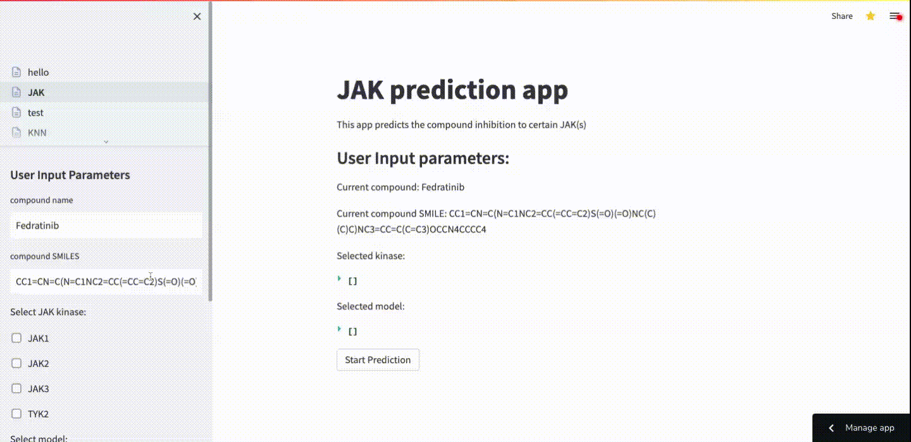

# New JAK inhibitor discovery based on machine learning

1. Data processing

   Data were extracted from pubchem, bindingDB, and ChemBL as csv files. Empty files deleted. Aim is to build separate model for JAK1, JAK2, JAK3, and TYK2 to predict inhibitors.
   raw data was handled: 
     * Active: 1; IC50 < 10uM
     * Inactive: 0; IC50 > 10uM
     * Unspecifed: -1 
     * Inconclusive: deleted, not in file anymore

   CID (Compound ID) was replaced as smiles. 

   Further, the unspecifed -1 was merged with Inactive 0 as there were much fewer inactive drugs. 

   Same assay data were merged into a large csv file. 

   Since data were extracted from bunch of assays, drugs with different labels (both 0 and 1) are common. We delete all those biased drugs (single SMILES with both labels 0 and 1), and delete duplicate (same SMILES appears several times). Thus, the SMILES strings in our data set are unique (appear only once) and with a certain label (either 0 or 1). 
   
   
2. Model pretraining

   213,000 compounds were extracted from ChemBL without label and were used to pretrain CNN, chemBERTa and GVAE. 
  
4. Model building (classification)

   * SVM, KNN, RF, RGBoost (using MACCS fingerprints as input)
   
   * CNN, chemBERTa (using SMILES as input)
   
   * GCN, GAT, RGCN, GVAE (using molecule graph as input) 
   
   Label: active 1, inactive 0. 
   

## App for JAK inhibition prediction: 

#### Compatible with Edge, Chrome, and Safari, may encounter sidebar problem on Firefox.

Since chemBERTa models are large, it may take some time to open the web application directly through streamlit cloud. Please wait patiently till the web page is loaded.


<!-- [](https://yingzibu-jak-app-final-2-hello-s2gl4s.streamlitapp.com/) -->

[](https://yingzibu-jak-app-final-2-hello-s2gl4s.streamlitapp.com/)

<!-- Once you deploy your app, you can embed this badge right into your GitHub readme.md as follows:

```markdown
[](https://yingzibu-jak-app-final-2-hello-s2gl4s.streamlitapp.com/)
```
 -->


   
